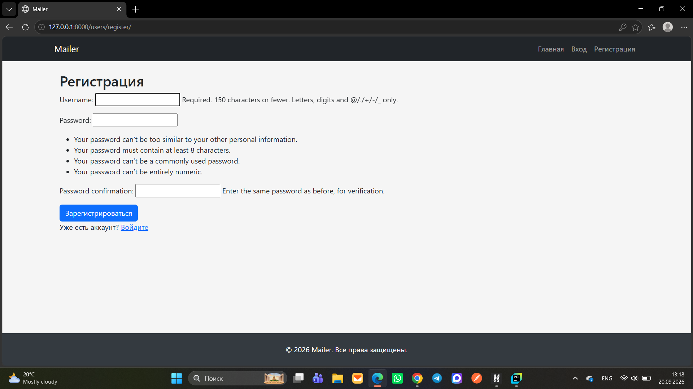
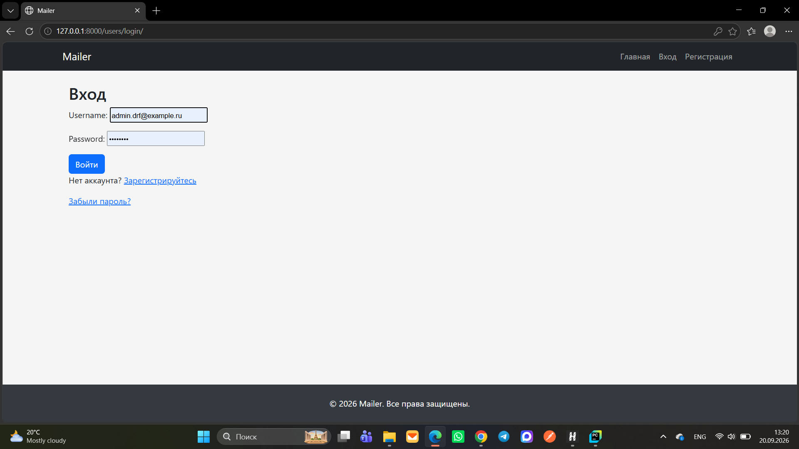
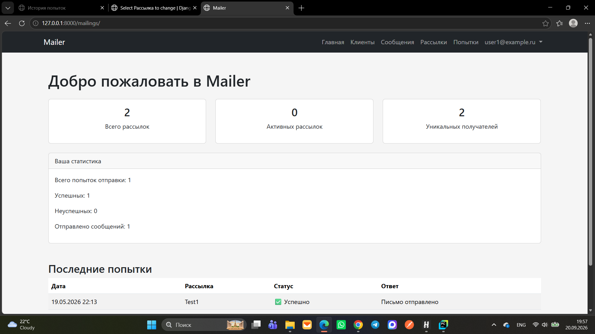
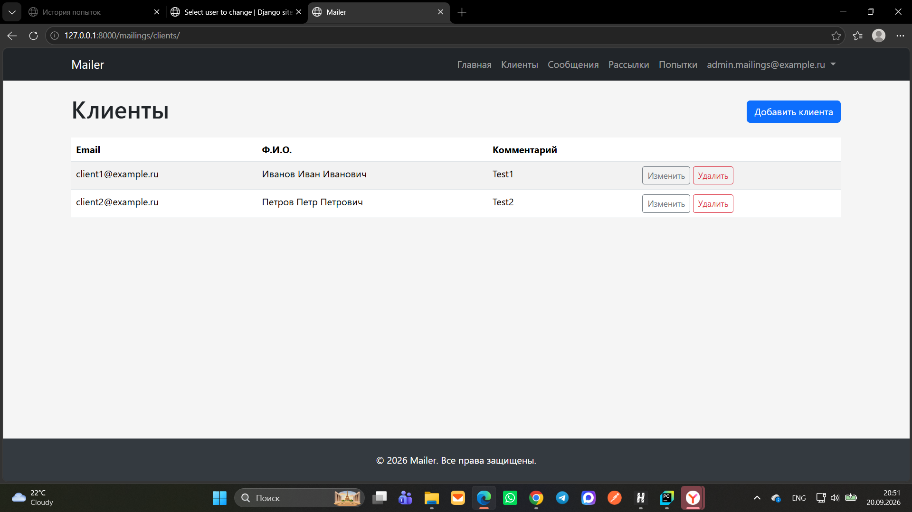
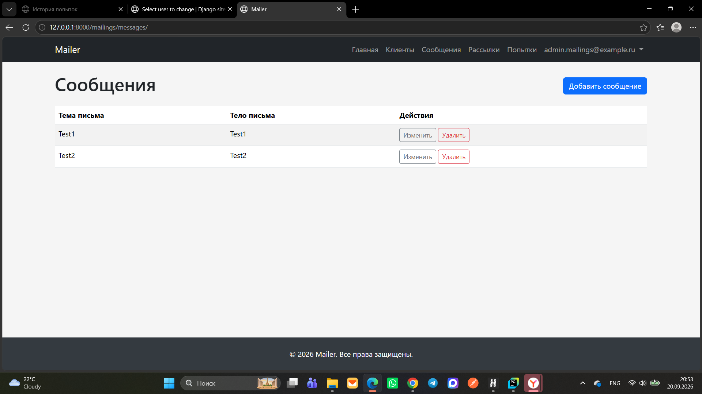
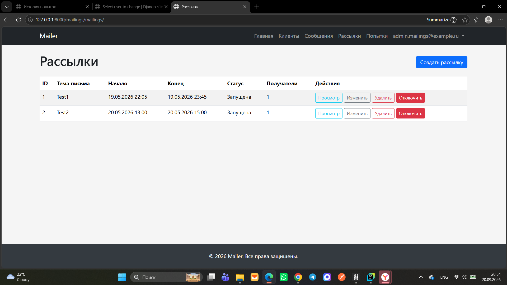
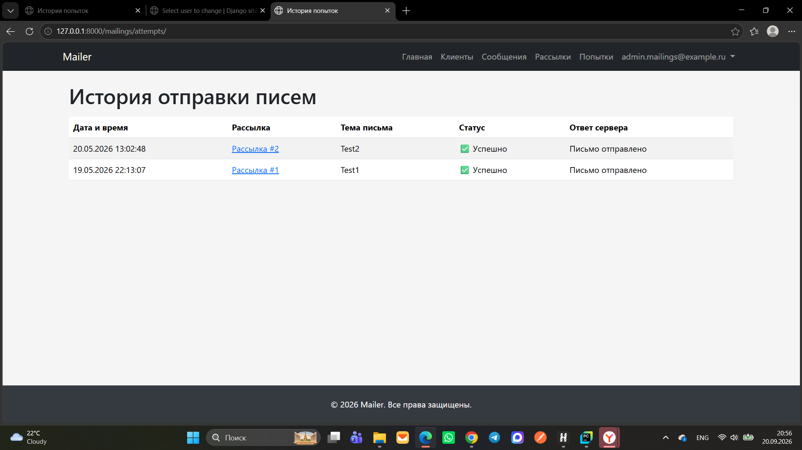
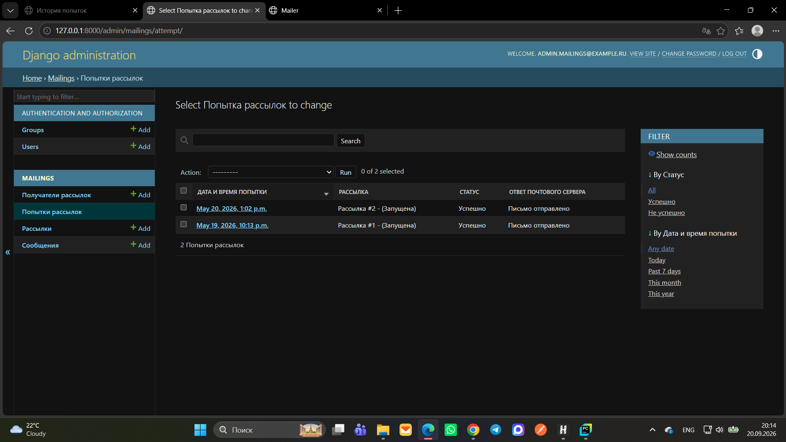

# Mailer — сервис управления email-рассылками

**Mailer** — это веб-приложение на Django, которое позволяет пользователям создавать, управлять и отслеживать
email-рассылки. Сервис поддерживает планирование рассылок, ручной запуск, логирование попыток, разграничение
прав (пользователь/менеджер), кеширование через Redis и статистику.

## Основные возможности

- **Управление клиентами** (CRUD): email, ФИО, комментарий.
- **Управление сообщениями** (CRUD): тема и тело письма.
- **Управление рассылками**: задание времени начала и окончания, выбор сообщения, выбор получателей. Статус рассылки вычисляется автоматически (Создана / Запущена / Завершена).
- **Ручной запуск рассылки** (с проверкой попадания в интервал дат).
- **Логирование попыток отправки** (дата, статус, ответ почтового сервера) с использованием `bulk_create` для оптимизации.
- **Аутентификация и регистрация** пользователей (вход, выход, восстановление пароля через email).
- **Роли и права**:
  - *Обычный пользователь*: управляет только своими клиентами, сообщениями и рассылками.
  - *Менеджер*: просмотр всех клиентов и рассылок, просмотр списка пользователей, блокировка пользователей, отключение рассылок.
- **Статистика** на главной странице: общее число рассылок, активных рассылок, уникальных получателей; персональная статистика (попытки, успешные/неуспешные).
- **Кеширование** через Redis (главная страница, статистика).

## 🛠️ Технологии

- Python 3.13
- Django 6.0
- PostgreSQL (база данных)
- Redis (кеширование)
- Poetry (управление зависимостями)
- Bootstrap 5 (фронтенд)

## Установка и запуск

### Требования

- Установленный Python 3.13+
- PostgreSQL (работающий сервер)
- Redis (работающий сервер)
- Poetry (рекомендуется) или pip

## 📁 Структура проекта

```
mailing-service/
├── config/ # Настройки проекта
├── mailings/ # Основное приложение
│ ├── management/commands/run_mailing.py
│ ├── migrations/ # Миграции БД
│ ├── templates/mailings # Шаблоны приложения
│ ├── init.py
│ ├── admin.py
│ ├── apps.py
│ ├── forms.py
│ ├── models.py    # Client, Message, Mailing, Attempt
│ ├── services.py  # send_mailing (batch)
│ ├── tests.py
│ ├── urls.py # Маршруты приложения
│ └── views.py # CRUD, статистика, отправка
├── static/ # Статические файлы
├── screenshots/ # Скриншоты (демонстрация работы проекта)
├── users/   # аутентификация
│ ├── migrations/ 
│ ├── templates/users # Шаблоны приложения
│ ├── init.py
│ ├── admin.py
│ ├── apps.py
│ ├── forms.py
│ ├── models.py    
│ ├── tests.py
│ ├── urls.py # Маршруты приложения
│ └── views.py # регистрация, логин, восстановление пароля
├── .env # Переменные окружения
├── .env.example # Пример .env файла
├── .flake8 # Конфигурация линтера
├── .gitignore
├── manage.py # Управляющий скрипт Django
├── poetry.lock # Зафиксированные версии зависимостей
├── pyproject.toml # Зависимости проекта
└── README.md
```

## Установка и запуск

### 1. Клонирование репозитория

```bash
git clone https://github.com/Margarita2405/mailing-service
cd mailing-service
```

### 2. Создать базу данных PostgreSQL

CREATE DATABASE mailing_service;

### 3. Создать файл .env в корне проекта (по примеру .env.example):

```text
SECRET_KEY=your_secret_key_here

DEBUG=True

# НАСТРОЙКИ ПОДКЛЮЧЕНИЯ К PostgreSQL
DATABASE_NAME=mailing_service
DATABASE_USER=your_user_name
DATABASE_PASSWORD=your_password
DATABASE_HOST=localhost
DATABASE_PORT=5432

# GITHUB TOKEN
# Personal Access Token для GitHub
# Создайте на: https://github.com/settings/tokens
# Необходимые scope: repo, read:org, user (в зависимости от нужд)
GITHUB_TOKEN=your_github_token_here
```

### 4. Создать и применить миграции

```bash
python manage.py makemigrations
python manage.py migrate
```

### 5. Собрать статические файлы 

```bash
python manage.py collectstatic
```

### 6. Создать суперпользователя

```bash
python manage.py createsuperuser
```

### 7. Кеширование

В проекте используется **Redis** в качестве бэкенда кеширования. Настроены:
- Низкоуровневое кеширование на главной странице (общая статистика кешируется на 15 минут).
- Кеш страницы списков (клиентов, сообщений, рассылок, попыток) **отключён** сознательно, чтобы
- пользователи видели актуальные данные сразу после создания/изменения/удаления объектов.

- Для запуска Redis локально выполните:

```bash
redis-server
```

- Проверить работу Redis можно командой:

```bash
redis-cli ping
# Должен вернуть PONG
```

### 8. Запуск сервера разработки

```bash
python manage.py runserver
Проект будет доступен по адресу: http://127.0.0.1:8000
```

## Настройка прав доступа (группа "Менеджер")

Для работы роли менеджера необходимо создать группу и назначить права:

```bash
python manage.py shell

from django.contrib.auth.models import Group, Permission
group, _ = Group.objects.get_or_create(name='Manager')
perms = Permission.objects.filter(codename__in=[
    'can_view_all_mailings',
    'can_view_all_clients',
    'can_view_users',
    'can_block_users',
    'can_disable_mailings'
])
group.permissions.set(perms)
```

После этого добавьте нужного пользователя в группу через админку или shell.

## 📚 Использование

| URL | Описание                                                                  |
| :--- |:--------------------------------------------------------------------------|
| `/users/register/` | Регистрация пользователя                                                  |
| `/users/login/` | Вход в систему                                                            |
| `/mailings/clients/` | Клиенты                                                                   |
| `/mailings/messages/` | Сообщения                                                                 |
| `/mailings/mailings/` | Рассылки (создание, редактирование, детальный просмотр с ручным запуском) |
| `/mailings/attempts/` | Попытки (история отправок)                                                |
| `/admin/` | Админка                                                                   |
| `/mailings/` | Главная страница (статистика и последние попытки)                         |


## Запуск рассылки вручную
На детальной странице рассылки (только если текущее время находится между start_time и end_time) появляется
кнопка «Запустить вручную». При нажатии письма отправляются всем выбранным получателям, а в базу добавляются
записи попыток.

## Запуск рассылок через командную строку

```bash
python manage.py run_mailing
```
Команда находит все активные рассылки (текущее время в интервале) и отправляет их.

## Тестирование

Для проверки корректности работы рекомендуется:
- Создать двух пользователей.
- Каждому добавить клиентов и сообщения.
- Убедиться, что пользователь видит только свои объекты.
- Назначить одного из пользователей менеджером и проверить, что он видит всех клиентов и рассылки.
- Создать рассылку с интервалом, включающим текущее время, и запустить вручную.
- Проверить появление записей в «Попытках» и обновление статистики на главной.


## 📊 Демонстрация работы проекта

### 1. Регистрация нового пользователя
Страница создания аккаунта на сайте. 


### 2. Вход в личный кабинет
Страница входа в личный кабинет с помощью ввода логина и пароля.


### 3. Главная страница
Приветствие и отображение статистики: общее число рассылок, активных рассылок, уникальных получателей; персональная статистика (попытки, успешные/неуспешные).


### 4. Клиенты
Страница добавления, редактирования и удаления клиентов.


### 5. Сообщения
Страница добавления, редактирования и удаления сообщений.


### 6. Рассылки
Страница добавления, редактирования, удаления и отключения рассылок.


### 7. Попытки
История отправки писем.


### 8. Панель администратора (Django Admin)
Централизованный интерфейс администрирования пользователей и групп, ведения получателей рассылок, попыток и сообщений.


---

## Документация:

Для получения дополнительной информации обратитесь 
к [документации](README.md).

## Лицензия

Проект выполнен в рамках курсовой работы. Свободное использование только в учебных целях.

## 👩‍💻 Автор

**Маргарита Буршева**
- **Email:** mbursheva@mail.ru
- **GitHub Проект:** [mailing-service](https://github.com)

*Курсовой проект выполнен в рамках программы обучения Университета Skypro.*
